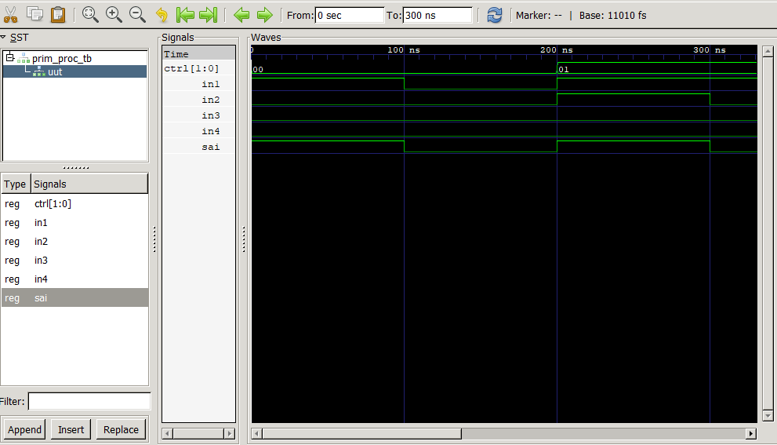

# Coleção de Componentes VHDL

Este repositório contém uma coleção de componentes VHDL desenvolvidos para fins de estudo e prática. Cada componente está localizado em sua própria pasta, contendo o código-fonte (RTL), um testbench para verificação e uma imagem do resultado da simulação.

Este projeto foi desenvolvido com o auxílio do Google Gemini, conforme o histórico de conversa [neste link](https://g.co/gemini/share/d6f7c5c786bf).

## Ferramentas Utilizadas

* **Síntese e Simulação:** [GHDL](https://ghdl.github.io/ghdl/)
* **Visualização de Ondas:** [GTKWave](https://gtkwave.sourceforge.net/)

## Componentes

O projeto é dividido nos seguintes componentes:

### 1. Multiplexer 4x1 (`01_multiplexer_4x1`)

Um multiplexador básico de 4 entradas de 1 bit para 1 saída, controlado por um seletor de 2 bits.

* **`prim_proc.vhd`**: Código RTL do multiplexador.
* **`prim_proc_tb.vhd`**: Testbench que verifica todas as 4 combinações do seletor.

#### Simulação


### 2. Decodificador N-bit (`02_decoder_n_bit`)

Um decodificador genérico que recebe uma entrada de `N` bits e ativa uma de `2^N` saídas. O componente foi implementado com duas arquiteturas distintas para fins de comparação:
1.  `n_bit_d_of`: Utiliza um bloco `process`.
2.  `n_bit_d_generate`: Utiliza uma estrutura concorrente `for-generate`.

O testbench instancia e simula ambas as arquiteturas com `N=4`.

* **`n_bit_d.vhd`**: Código RTL do decodificador com as duas arquiteturas.
* **`n_bit_d_tb.vhd`**: Testbench para `N=4`.

#### Simulação


### 3. Transmissor Serial (FSM) (`03_serial_transmitter_fsm`)

Uma Máquina de Estados Finitos (FSM) que implementa um transmissor serial assíncrono. Ao receber um sinal `send`, ela transmite uma palavra de 8 bits (`palavra`) pela `linha` serial, seguindo um protocolo simples com start bit, 8 bits de dados e stop bit.

* **`transmissor.vhd`**: Código RTL da FSM do transmissor.
* **`transmissor_tb.vhd`**: Testbench que envia duas palavras diferentes para verificar a FSM.

#### Simulação


---

## Como Compilar e Simular

Para compilar e executar a simulação de cada componente, navegue até a raiz do projeto e use os seguintes comandos GHDL.

**Importante:** Os arquivos de onda (`.vcd`) não são armazenados no repositório (conforme definido no `.gitignore`). Você pode gerá-los localmente executando os comandos abaixo.

### 1. Multiplexer 4x1

```bash
# Análise (Compilação)
ghdl -a 01_multiplexer_4x1/prim_proc.vhd
ghdl -a 01_multiplexer_4x1/prim_proc_tb.vhd

# Elaboração
ghdl -e prim_proc_tb

# Execução (Simulação)
ghdl -r prim_proc_tb --vcd=multiplexer.vcd

# Visualização
gtkwave multiplexer.vcd
```

### 2. Decodificador N-bit

```bash
# Análise (Compilação)
ghdl -a 02_decoder_n_bit/n_bit_d.vhd
ghdl -a 02_decoder_n_bit/n_bit_d_tb.vhd

# Elaboração
ghdl -e n_bit_d_tb

# Execução (Simulação)
ghdl -r n_bit_d_tb --vcd=decoder.vcd

# Visualização
gtkwave decoder.vcd
```

### 3. Transmissor Serial

```bash
# Análise (Compilação)
ghdl -a 03_serial_transmitter_fsm/transmissor.vhd
ghdl -a 03_serial_transmitter_fsm/transmissor_tb.vhd

# Elaboração
ghdl -e transmissor_tb

# Execução (Simulação)
ghdl -r transmissor_tb --vcd=transmitter.vcd

# Visualização
gtkwave transmitter.vcd
```