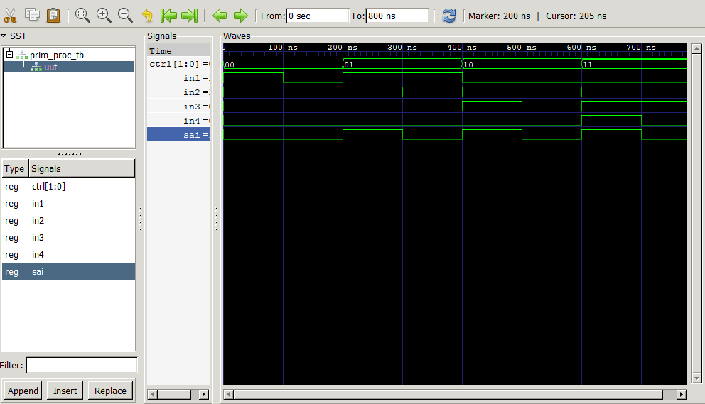

# Coleção de Componentes VHDL

Este repositório contém uma coleção de componentes VHDL desenvolvidos para fins de estudo e prática. Cada componente está localizado em sua própria pasta, contendo o código-fonte (RTL), um testbench para verificação e uma imagem do resultado da simulação.


## Ferramentas Utilizadas

* **Síntese e Simulação:** [GHDL](https://ghdl.github.io/ghdl/)
* **Visualização de Ondas:** [GTKWave](https://gtkwave.sourceforge.net/)

## Componentes

O projeto é dividido nos seguintes componentes:

### 1. Multiplexer 4x1 (`01_multiplexer_4x1`)

Este componente demonstra a implementação de um multiplexador 4x1 e a importância de uma lista de sensibilidade (`sensitivity list`) correta em um processo combinacional. Foram criadas duas versões:

#### Versão 1: Lista de Sensibilidade Incompleta (Bug)

Nesta versão, o sinal `in1` foi omitido da lista de sensibilidade do `process`.

* **Código:** `process (in2, in3, in4, ctrl)`
* **Comportamento:** Quando `ctrl = "00"`, a saída `sai` deveria seguir o valor de `in1`. No entanto, como `in1` não está na lista, o processo não é reavaliado quando `in1` muda. Isso faz com que o VHDL descreva um **latch**, que "memoriza" o valor anterior, em vez de um circuito puramente combinacional.
* **Arquivos:** `v1_bug_sensitivity_list/`

**Simulação (Com Bug):**
Observe que no intervalo de 100ns a 200ns, `in1` vai para '0', mas `sai` permanece em '1', demonstrando o comportamento incorreto.



#### Versão 2: Lista de Sensibilidade Corrigida

Nesta versão, todos os sinais de entrada que são lidos dentro do processo foram adicionados à lista de sensibilidade.

* **Código:** `process (in1, in2, in3, in4, ctrl)`
* **Comportamento:** O circuito agora se comporta como um multiplexador combinacional perfeito. A saída `sai` reflete imediatamente qualquer mudança nas entradas relevantes, conforme determinado pelo seletor `ctrl`.
* **Arquivos:** `v2_corrected_sensitivity_list/`

**Simulação (Corrigida):**
Observe que no intervalo de 100ns a 200ns, `sai` segue corretamente a transição de `in1` para '0'.


### 2. Decodificador N-bit (`02_decoder_n_bit`)

[cite_start]Um decodificador genérico que recebe uma entrada de `N` bits e ativa uma de `2^N` saídas. [cite: 36, 37] O componente foi implementado com duas arquiteturas distintas para fins de comparação:
1.  [cite_start]`n_bit_d_of`: Utiliza um bloco `process`. [cite: 38]
2.  [cite_start]`n_bit_d_generate`: Utiliza uma estrutura concorrente `for-generate`. [cite: 39, 40, 41]

[cite_start]O testbench instancia e simula ambas as arquiteturas com `N=4`. [cite: 61, 62]

* [cite_start]**`n_bit_d.vhd`**: Código RTL do decodificador com as duas arquiteturas. [cite: 35]
* [cite_start]**`n_bit_d_tb.vhd`**: Testbench para `N=4`. [cite: 60]

#### Simulação


### 3. Transmissor Serial (FSM) (`03_serial_transmitter_fsm`)

[cite_start]Uma Máquina de Estados Finitos (FSM) que implementa um transmissor serial assíncrono. [cite: 8, 9] [cite_start]Ao receber um sinal `send`, ela transmite uma palavra de 8 bits (`palavra`) pela `linha` serial [cite: 7][cite_start], seguindo um protocolo com start bit [cite: 22][cite_start], 8 bits de dados e stop bit[cite: 27]. [cite_start]A saída `busy` indica quando a transmissão está em andamento. [cite: 29]

* [cite_start]**`transmissor.vhd`**: Código RTL da FSM do transmissor. [cite: 7]
* [cite_start]**`transmissor_tb.vhd`**: Testbench que envia duas palavras diferentes para verificar a FSM. [cite: 44]

#### Simulação


---

## Como Compilar e Simular

Para compilar e executar a simulação de cada componente, navegue até a raiz do projeto e use os seguintes comandos GHDL.

**Importante:** Os arquivos de onda (`.vcd`) não são armazenados no repositório (conforme definido no `.gitignore`). Você pode gerá-los localmente executando os comandos abaixo.

### 1. Multiplexer 4x1

**Versão com Bug:**
```bash
# Análise (Compilação)
ghdl -a 01_multiplexer_4x1/v1_bug_sensitivity_list/prim_proc_bug.vhd
ghdl -a 01_multiplexer_4x1/v1_bug_sensitivity_list/prim_proc_tb.vhd

# Elaboração
ghdl -e prim_proc_tb

# Execução (Simulação)
ghdl -r prim_proc_tb --vcd=multiplexer_bug.vcd

# Visualização
gtkwave multiplexer_bug.vcd
```

**Versão Corrigida:**
```bash
# Análise (Compilação)
ghdl -a 01_multiplexer_4x1/v2_corrected_sensitivity_list/prim_proc_corrected.vhd
ghdl -a 01_multiplexer_4x1/v2_corrected_sensitivity_list/prim_proc_tb.vhd

# Elaboração
ghdl -e prim_proc_tb

# Execução (Simulação)
ghdl -r prim_proc_tb --vcd=multiplexer_corrected.vcd

# Visualização
gtkwave multiplexer_corrected.vcd
```

### 2. Decodificador N-bit

```bash
# Análise (Compilação)
ghdl -a 02_decoder_n_bit/n_bit_d.vhd
ghdl -a 02_decoder_n_bit/n_bit_d_tb.vhd

# Elaboração
ghdl -e n_bit_d_tb

# Execução (Simulação)
ghdl -r n_bit_d_tb --vcd=decoder.vcd

# Visualização
gtkwave decoder.vcd
```

### 3. Transmissor Serial

```bash
# Análise (Compilação)
ghdl -a 03_serial_transmitter_fsm/transmissor.vhd
ghdl -a 03_serial_transmitter_fsm/transmissor_tb.vhd

# Elaboração
ghdl -e transmissor_tb

# Execução (Simulação)
ghdl -r transmissor_tb --vcd=transmitter.vcd

# Visualização
gtkwave transmitter.vcd
```
